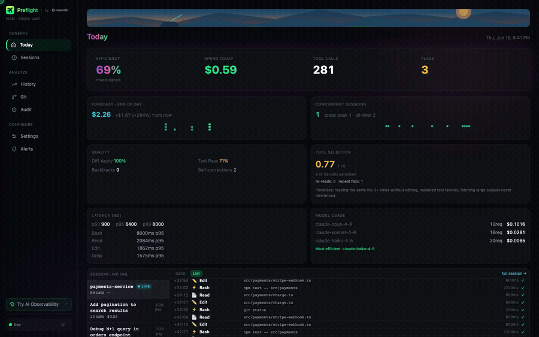

<div align="center">
  
  <h1>Preflight</h1>
  <p><strong>Observability for AI Coding Assistants</strong></p>

[](LICENSE)
[](.nvmrc)
[](#quick-start)
[](#dashboards)

[**Docs**](docs/ADVANCED.md) • [**Examples**](examples/) • [**Community**](https://support.newrelic.com/s/) • [**Contributing**](CONTRIBUTING.md) • [**Internal**](docs/INTERNAL_USAGE.md)

</div>

---

## Why Your AI Tool Needs Observability

Your AI coding assistant makes hundreds of decisions every session — what to read, what to edit, when to run commands. But you can't see any of it. You know it was fast, but was it _efficient_? You got a PR merged, but how much did it cost? You fixed a bug, but did it get stuck in a loop first?

**Preflight is observability for agentic coding** — the actions, cost, and efficiency of your AI coding assistant as it works. See exactly what's happening, how much it costs, and where your AI is wasting time.

**Local-first by design.** Preflight runs entirely on your machine and sends your data nowhere by default. A live dashboard at `localhost:7777` shows your sessions in real time, fully offline. Connect a New Relic account only when you want more — team rollups, alerting, and cross-session history. You choose: **local-only**, **New Relic**, or **both**.

---

## Demo



See cost breakdown, efficiency scoring, anti-patterns, and live session tracking in action.

---

## What You Get

### Visibility

- **Every action captured** — file reads, edits, commands, searches
- **Live session dashboard** — see what's happening right now
- **Historical trends** — analyze patterns over weeks and months

### Cost Control

- **USD spend tracking** — per session, day, and week
- **Per-model breakdown** — know which models cost most
- **Budget alerts** — get notified before you overspend
- **Forecasting** — project monthly burn rate

### Efficiency Insights

- **Efficiency score** — 0–100 score per task, based on how directly the AI worked
- **Anti-pattern detection** — catches re-reads, blind edits, stuck loops
- **Personalized recommendations** — optimize your AI workflow
- **Weekly coaching reports** — narrative analysis vs. your historical baseline

### Dashboards

- **Local dashboard** — live session view at `localhost:7777`, no account required
- **7 pre-built New Relic dashboards** — deploy in seconds _(New Relic mode)_:
  - **Overview** — session stats, cost summary, top tools
  - **Personal** — 30-day self-reflection scoped to you
  - **Session Detail** — deep-dive into a single session's tool calls
  - **Team View** — aggregated cost and efficiency across developers
  - **Manager View** — high-level team metrics, no tool-call content
  - **Platform Comparison** — Claude Code vs. Cursor vs. Windsurf, etc.
  - **Security Audit** — audit trail of sensitive file access

---

## Quick Start

### 1. Install

```bash
npm install -g @newrelic/preflight
```

### 2. Run setup

```bash
preflight setup
```

The wizard defaults to **local mode** — press Enter through the prompts and you're set. It wires Preflight into your AI tool (hooks + MCP server) and writes config to `~/.newrelic-preflight/`. Takes under a minute, no account required.

When prompted, pick a mode:

| Mode                  | What it does                                                         | New Relic account? |
| --------------------- | -------------------------------------------------------------------- | ------------------ |
| **local** _(default)_ | Everything stays on your machine; live dashboard at `localhost:7777` | Not needed         |
| **cloud**             | Ships telemetry to New Relic                                         | Required           |
| **both**              | Local dashboard **and** New Relic                                    | Required           |

### 3. Start coding

Restart your AI tool — hooks and the MCP server load at session start. Every tool call is captured automatically. Open **http://localhost:7777** to watch your session live.

---

## Works With

**Claude Code** • **Cursor** • **Windsurf** • **GitHub Copilot** • **Zed** • **Continue.dev** • **Amazon Q Developer**

---

## Connect New Relic (optional)

Local mode is fully featured on its own. Connect a New Relic account to unlock:

- **Team & manager dashboards** across multiple developers
- **Alerting** on cost spikes, low efficiency, and stuck loops
- **Cross-session history**, trends, and weekly coaching reports

Re-run `preflight setup` and choose **cloud** or **both**, or configure it non-interactively:

```bash
preflight install \
  --mode cloud \
  --license-key YOUR_LICENSE_KEY \
  --account-id YOUR_ACCOUNT_ID
```

EU accounts add `--eu`. FedRAMP accounts add `--fedramp`.

Then deploy the prebuilt dashboards:

```bash
NEW_RELIC_API_KEY=NRAK-... NEW_RELIC_ACCOUNT_ID=12345 \
  preflight deploy-dashboards --all
```

You'll need a **license key** (telemetry ingest) and your **account ID**, plus a **user API key** (`NRAK-…`) to deploy dashboards and alerts. See [ADVANCED.md](docs/ADVANCED.md) for alerts, OTLP export to other backends, and Terraform.

> **Data ingest note:** Telemetry sent to New Relic counts against your account's data ingest. On paid plans, standard ingest rates apply. Monitor your usage under **NR One → Data Management → Data Ingestion**.

---

## Requirements

### Required

- **Node.js v22 or higher** ([get it](https://nodejs.org) or use [nvm](https://github.com/nvm-sh/nvm))
- **An AI coding tool** (Claude Code recommended for deepest integration)

### Optional

- **New Relic account** — only for `cloud`/`both` mode. Skip it to run local-only (the default).
- **User API key** (`NRAK-…`) — only needed to deploy dashboards and alerts

---

## Other Commands

```bash
preflight doctor               # Run 6 diagnostic checks and print actionable fix commands
preflight validate             # Check config for syntax errors and unknown keys
preflight update               # Pull latest version and rebuild (source installs only — npm installs: npm install -g @newrelic/preflight@latest)
preflight uninstall            # Remove hooks and MCP config (prompts with a summary first)
preflight uninstall --yes      # Skip the confirmation prompt (for scripts and CI)
preflight uninstall --daemon   # Remove only the background dashboard daemon
```

Add `--project` to `install`/`uninstall` to scope changes to the current directory only.

**WSL users:** `preflight setup` will ask which Claude Code you're running. You can also set it explicitly:

- `--windows-cc` — Windows Claude Code (the desktop app); uses `wsl.exe` hooks and Windows paths
- `--linux-cc` — Linux Claude Code installed via npm inside WSL

---

## Documentation

- [**ADVANCED.md**](docs/ADVANCED.md) — Configuration, dashboards, alerts, Terraform
- [**CONTRIBUTING.md**](CONTRIBUTING.md) — Development, testing, submitting PRs
- [**SECURITY.md**](./SECURITY.md) — Security guidelines and best practices
- [**PRIVACY.md**](./PRIVACY.md) — Data collection inventory and pre-cloud checklist

---

## From Source

Develop, test, or run the latest unreleased version:

```bash
git clone https://github.com/newrelic-experimental/preflight
cd preflight
nvm use              # Switch to Node v24
npm install          # Install dependencies
npm run build        # Compile TypeScript
npm link             # Register preflight on PATH
```

Then run `preflight setup` as usual.

---

## License

Preflight is open source under the [Apache License 2.0](LICENSE).

---

## Contributing

We welcome contributions! See [CONTRIBUTING.md](CONTRIBUTING.md) for how to get started. Join the [New Relic Community](https://support.newrelic.com/s/) to share ideas, ask questions, or discuss features.

---

<div align="center">
  <p><strong>Built by New Relic • Designed for developers who use AI</strong></p>
</div>
